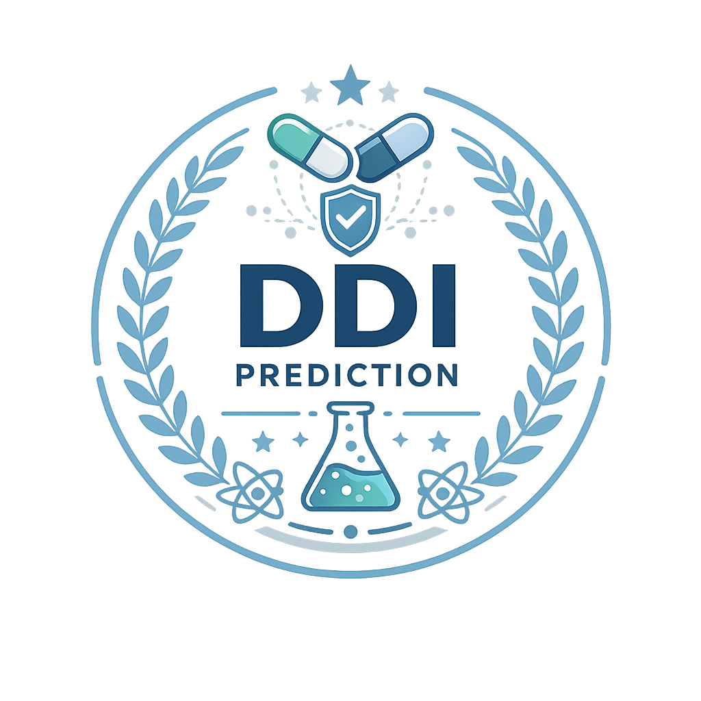
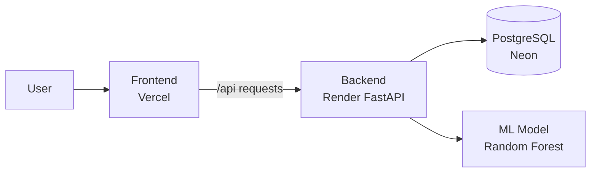

# DDI Predict

<div align="center">
  

  <h1>DDI Predict</h1>
  <p><strong>Drug-Drug Interaction Severity Prediction, made simple enough to trust and fast enough to use.</strong></p>

  <p>
    A full-stack machine learning app that helps people explore drug pairs, predict interaction severity, and understand the result with context.
  </p>

  <p>
    <a href="https://ddi-predict.vercel.app/">Live Frontend</a> ·
    <a href="https://ddi-predict-api.onrender.com/">Backend</a> ·
    <a href="https://ddi-predict-api.onrender.com/docs">API Docs</a>
  </p>
</div>

---

## What this project is

DDI Predict is built around a simple idea: when two drugs are taken together, the interaction severity should be easy to check, explain, and revisit.

The app takes two drug names, looks up their molecular properties, and sends them through a trained Random Forest model. The result is returned as one of three severity levels: Minor, Moderate, or Major. Along with the prediction, the app also shows confidence, probability breakdowns, drug details, history, and analytics so the user is not left with a black-box answer.

This repository contains the full product: the React frontend, the FastAPI backend, the database layer, the model inference code, and the training artifacts that power the prediction flow.

## Live deployment

- Frontend: [https://ddi-predict.vercel.app/](https://ddi-predict.vercel.app/)
- Backend: [https://ddi-predict-api.onrender.com/](https://ddi-predict-api.onrender.com/)
- API Docs: [https://ddi-predict-api.onrender.com/docs](https://ddi-predict-api.onrender.com/docs)

## Why it exists

The aim is not just prediction. The aim is clarity.

People should be able to:

- search drugs quickly,
- compare two drug names without friction,
- see the risk level in plain language,
- understand the confidence behind the answer,
- and revisit prior predictions when needed.

That is why the app includes more than a model endpoint. It also includes browsing, analytics, prediction history, and a clean UI with a recognizable icon and visual identity.

## Screens and experience

- Home page for quick entry into the app
- Predictor page for interaction checks
- Drug browser for searching and browsing the database
- Analytics page for dataset and model insights
- About page for project context

## Tech stack

- Frontend: React, Vite, React Router, Recharts, Framer Motion
- Backend: FastAPI, SQLAlchemy, asyncpg, Pydantic
- ML: scikit-learn Random Forest
- Database: PostgreSQL, with Neon used in production
- Hosting: Vercel for frontend, Render for backend

## Architecture



## Features

- Two-drug interaction prediction
- Severity classification with Minor, Moderate, Major outputs
- Probability and confidence breakdowns
- Drug search, browsing, and detail views
- Prediction history
- Dataset and model analytics
- Production deployment with CORS support
- Branded UI using the project icon

## How it works

1. The frontend collects two drug names.
2. The backend resolves those names against the drug database.
3. The app extracts the molecular features needed by the model.
4. The trained model predicts severity and confidence.
5. The result is stored, returned, and shown in the UI.

## Local development

### Prerequisites

- Node.js 22+
- Python 3.11+
- uv
- PostgreSQL, or Docker Desktop if you want to run the database locally

### Backend

```bash
cd backend
uv sync
uv run python scripts/seed_db.py
uv run uvicorn app.main:app --reload --port 8000
```

### Frontend

```bash
cd frontend
npm install
npm run dev
```

Then open [http://localhost:5173](http://localhost:5173).

## Environment variables

### Backend

- `DATABASE_URL` - async database connection string
- `DATABASE_SYNC_URL` - sync database connection string
- `CORS_ORIGINS` - comma-separated list of allowed frontend origins
- `APP_ENV` - set to `production` on Render
- `APP_SECRET_KEY` - optional, currently has a default fallback

### Frontend

- `VITE_API_URL` - backend base URL, use `https://ddi-predict-api.onrender.com/api`

## API endpoints

- `GET /` - service status
- `GET /health` - health check
- `POST /api/predict` - predict interaction severity
- `GET /api/drugs` - list and search drugs
- `GET /api/drugs/search?q=` - autocomplete drug search
- `GET /api/drugs/{name}` - drug detail view
- `GET /api/history` - recent predictions
- `GET /api/stats` - dataset and model statistics

## Dataset and model

- Dataset source: DDInter Drug-Drug Interaction Database
- Model type: Random Forest classifier
- Severity classes: Minor, Moderate, Major
- Model metadata and artifacts are stored under `backend/model_artifacts/`

## Repository layout

- `backend/` - FastAPI app, database layer, and model inference code
- `frontend/` - Vite React app
- `dataset/` - raw and processed datasets
- `render.yaml` - Render deployment config
- `docker-compose.yml` - local PostgreSQL setup
- `DDI.ipynb` - notebook kept for exploration and analysis

## Deployment notes

- The backend root URL returns a friendly status JSON for quick checks.
- The frontend should always point to the backend `/api` path.
- CORS is configured to work with Render and Vercel domains.

## Visual identity

The icon in this repository is part of the project identity and is used to make the app feel like a finished product rather than just a demo. It is also the image shown at the top of this README.

## License

MIT
